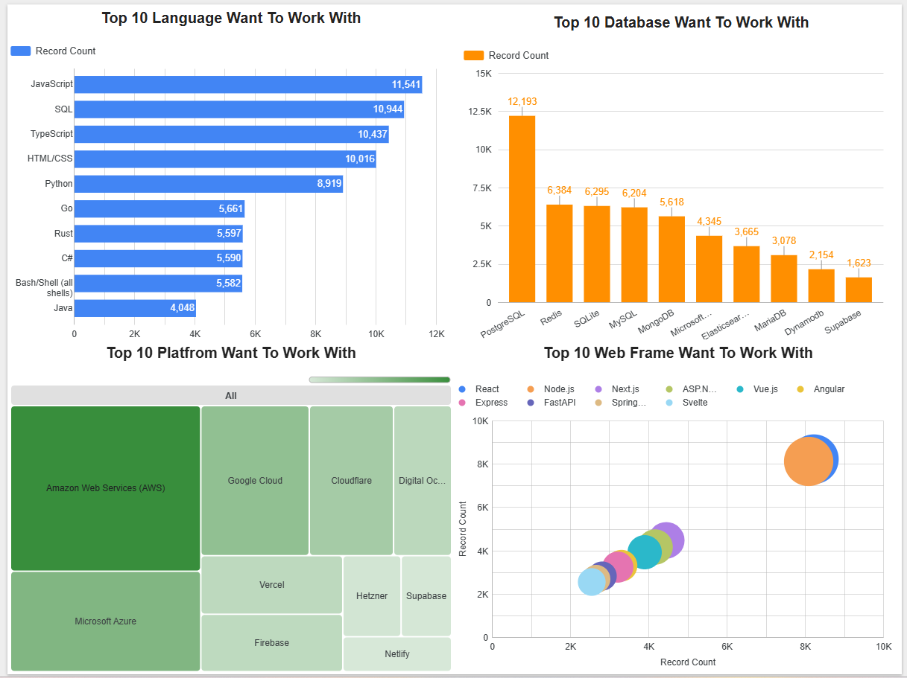

# Global Technology Trends Analysis: Developer Skills, Salaries, and Market Demand

## Project Overview

This project analyzes global developer trends using survey data and job postings to identify high-demand skills, salary patterns, and future technology directions.

The goal is to understand how **technology usage, developer preferences, and market demand align (or misalign)**, and to derive insights that can guide career decisions and skill development strategies.

The analysis covers programming languages, databases, job market demand, salary distribution, and developer demographics, using an end-to-end data analytics workflow.

---

## Objectives

* Identify the most in-demand programming languages and technologies
* Compare current vs future technology preferences among developers
* Analyze salary trends across programming languages
* Evaluate how job market demand aligns with developer interest and compensation
* Provide actionable insights for aspiring data professionals

---

## Tools & Technologies

* **Python** (pandas, matplotlib, seaborn) – data cleaning and analysis
* **SQL** – data querying and aggregation
* **Google Data Studio** – dashboard development
* **Jupyter Notebook** – analysis workflow

---

## Dataset

* Stack Overflow Developer Survey (developer preferences, salary, demographics)
* Job postings dataset (technology demand in the market)

---

## Key Insights

### 1. Core Technologies Remain Dominant

JavaScript, SQL, and Python consistently rank among the most widely used and desired technologies.
These tools form a **stable foundation for modern software development and data roles**.

### 2. Strong Demand for Relational Databases

PostgreSQL and other relational databases show sustained adoption, highlighting the continued importance of structured data systems.

### 3. Demand vs Salary Misalignment

Some technologies with high job demand do not offer the highest salaries, indicating that:

* market demand ≠ compensation
* niche or specialized skills may command higher pay

### 4. Emerging Technologies Are Gaining Traction

Languages such as Go and Rust, along with cloud platforms, show increasing interest for future use.
However, they have not yet displaced core technologies.

### 5. Stable but Evolving Technology Landscape

The ecosystem is not rapidly disrupted. Instead, it evolves gradually:

* core tools remain dominant
* new technologies are layered on top

---

## Dashboard

The Google Data Studio dashboard provides an interactive view of:

* Current technology usage
* Future technology trends
* Developer demographics

### Dashboard Preview

1. **Current Technology Usage**


2. **Future Technology Trend**


3. **Demographics**


## Methodology

### Data Processing

* Cleaned missing and inconsistent values
* Split multi-value columns (e.g., languages, databases)
* Transformed data into analysis-ready format

### Analysis Techniques

* Aggregation (groupby, counts, averages)
* Ranking top technologies
* Comparative analysis (current vs future trends)
* Data visualization using charts and dashboards

---

## Key Takeaways

* Strong foundational skills (Python + SQL) remain essential for data roles
* Market demand, salary, and developer preference are not always aligned
* Combining **core skills + emerging technologies** provides the best career advantage
* Real-world data analysis requires integrating multiple tools and perspectives

---

## How to Run

1. Clone this repository:

```
git clone https://github.com/your-username/technology-trends-analysis.git
```

2. Install required libraries:

```
pip install -r requirements.txt
```

3. Open notebooks in Jupyter Notebook or JupyterLab:

```
jupyter notebook
```

---

## Author

Xian Jin Lau

---

## Notes

This project was developed as part of the IBM Data Analyst Professional Certificate and enhanced into a portfolio-ready project to demonstrate practical data analytics skills.
